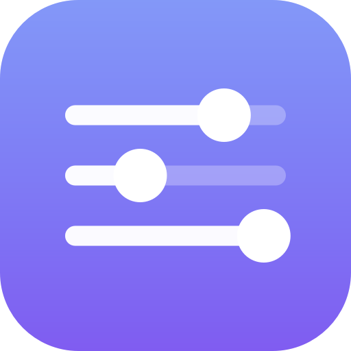
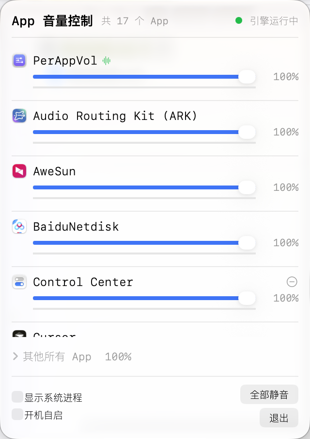

<div align="center">



<h1>PerAppVol</h1>

<h3>给 Mac 上的每个 App 单独调音量</h3>

<p>Windows 有音量合成器，macOS 没有 —— 补上这一块。</p>

<br />


<br /><br />

<strong>QQ 30% · 微信 60% · 音乐 100% · 提示音静音 —— 互不影响</strong>

<br /><br />

<pre><code>make install &amp;&amp; make autostart</code></pre>

<sup>或从 <a href="../../releases">Releases</a> 下载 DMG，双击「安装.command」</sup>

</div>

<br />

<p align="center">
<!-- 换成真实截图：把截图放到 docs/screenshot.png 并把下面的 pre 换成
      -->
<pre align="center">
┌────────────────────────────────────────────┐
│ App 音量控制      共 17 个 App   ● 引擎运行中 │
├────────────────────────────────────────────┤
│ 🔔 系统提示音            [−]                │
│    通知 / 警告提示音都走这里                  │
│    ───────────○──────────────   30%        │
│    ▬▬▬▬▬▬▁▁▁▁▁▁▁▁▁▁▁▁▁▁▁▁▁▁▁▁              │
│ ────────────────────────────────────────── │
│ 🎵 NetEaseMusic                           │
│    ─────────────────────○───────   72%     │
│ ────────────────────────────────────────── │
│ 💬 WeChat                                  │
│    ────────────○───────────────   45%      │
│                                            │
│ › 其他所有 App                       100%   │
│                                            │
│ ☑ 显示系统进程  ☑ 开机自启    全部静音  退出 │
└────────────────────────────────────────────┘
</pre>
</p>

---

## 能做什么

| | |
|---|---|
| **每 App 独立音量** | QQ 调 30%、微信调 60%、音乐 100%，互不影响 |
| **系统提示音单独控制** | 消息提示音/警告音走的是系统服务，**不归 App 管** —— PerAppVol 把它做成独立一路，夜里静音提示音、保留通话 |
| **全部静音 / 逐个静音** | 一键勿扰 |
| **实时电平表** | 每行滑块下有电平条，一眼看出是哪个 App 在出声 |
| **输出设备热切换** | 蓝牙耳机断开、换显示器，自动跟着切，设置不丢 |
| **设置持久化** | 按 bundle ID 记忆，App 移动/重装/更新都不丢；App 启动自动应用 |
| **开机自启** | 常驻菜单栏，挂了自动拉起 |
| **链接式限幅器** | 多 App 叠加过载时自动压限，不爆音 |

## 系统要求

| | |
|---|---|
| **CPU** | Apple Silicon (arm64) |
| **系统** | macOS **14.2** 或更高 |
| **权限** | 「屏幕与系统音频录制」（首次运行时引导授权） |

> 暂不支持 Intel Mac（无 x86 测试环境，不做未经验证的构建）。

## 安装

**方式一：下载 DMG**

1. 从 [Releases](../../releases) 下载 `PerAppVol-<版本>-arm64.dmg`
2. 双击 DMG → 双击 **「安装.command」**
3. 首次运行：**系统设置 → 隐私与安全性 → 屏幕与系统音频录制 → 打开 PerAppVol**

> 为什么不能直接拖到 Applications？见下方 FAQ。

**方式二：从源码构建**

```bash
git clone <repo>
cd mac-sound-control
make install          # 构建 + 装到 /Applications + 启动
make autostart        # 开机自启
```

## 使用

装好后菜单栏会出现一个扬声器图标，点开就是音量面板。

- **拖滑块**调该 App 音量（松手即时生效，支持拖动中实时跟随）
- 点右侧 **−** 把该 App 放回「其他所有 App」
- **全部静音**一键勿扰
- 勾 **开机自启**让设置始终生效

典型用法：

| 场景 | 怎么调 |
|---|---|
| 开会时压掉背景音乐 | 音乐 App 拖到 20% |
| 夜里不想要提示音 | 系统提示音拖到 0% |
| 只想听清某个人 | 其他全部压低，他的 App 拉满 |
| 录屏时不想录进音乐 | 音乐 App 拖到 0% |

## 常见问题

**Q：为什么要授权「屏幕与系统音频录制」？**
PerAppVol 需要读取各个 App 正在播放的音频才能分别调节音量。这是 macOS 提供的标准接口（CoreAudio Process Taps）。**不授权 = 抓不到音频 = 没有任何音量控制**。音频只在本机处理，不上传、不录制。

**Q：安装时提示「已损坏，无法打开」/「无法验证开发者」？**
这是 Gatekeeper 对**未公证**应用的正常拦截。终端里执行一条命令解除：

```bash
xattr -cr /Applications/PerAppVol.app
```

然后重新打开。（也可以右键 → 打开 → 再点「打开」。）

**Q：为什么不能直接把 App 拖进 Applications？**
因为那样装出来的 App 是**未签名**状态 —— macOS 不会把它列入隐私授权列表，**永远拿不到授权**，也就没有音量控制。「安装.command」会在你机器上生成一张本地签名证书并重签，这一步不能省。全程无需 Apple 开发者账号、无需管理员密码。

**Q：调 QQ / 微信 / 飞书 的音量，为什么管不到消息提示音？**
因为消息提示音**不是 App 播放的** —— 系统通知的提示音由 `systemsoundserverd` 统一播放。PerAppVol 把它做成独立的「系统提示音」一路，单独调它就行。App 自己的音频（语音消息、视频通话、App 内音效）才归该 App 那一根滑块管。

**Q：会不会有延迟？**
端到端理论预算 ≤ 40ms（滑块命令合并 25ms + 音频回调 10ms + 少量调度）。日常听感无感。

**Q：音频会被上传或录制吗？**
不会。所有音频只在本机的混音引擎里处理，没有网络代码。

## 已知限制

- **仅 Apple Silicon**（Intel Mac 暂不支持）
- **仅本机输出**，不支持按 App 路由到不同输出设备（计划中）
- **不支持音效/EQ**，只有音量与静音
- **不能上 Mac App Store**：音频 tap 与沙盒不兼容
- 分发给其他 Mac 需要 Developer ID 签名 + 公证（本机使用无需）

---

## 开发

```bash
make              # App + 命令行工具
make app          # 只要 App       → build/PerAppVol.app
make tools        # 只要命令行工具  → build/{perappvol,apptap,volctl}
make icon         # 重新生成图标
make dmg          # 打包 DMG
make install      # 装到 /Applications
make autostart    # 开机自启
make clean
```

```
src/engine/perappvol.m        混音引擎（CoreAudio tap / 聚合设备 / 渲染 / 限幅）
src/ui/PerAppVolApp.swift     菜单栏 UI（SwiftUI）
src/ui/Autostart.swift        开机自启（LaunchAgent）
src/tools/apptap.m            链路调试工具
src/tools/volctl.swift        系统总音量 / 设备切换
scripts/                      图标生成、开机自启
.github/workflows/            CI + 自动发版
docs/                         技术笔记
```

**发版**：推 `v*` 标签即自动构建 + 发布到 GitHub Releases（`.github/workflows/release.yml`）。

**技术实现、踩过的坑（18 条）、API 用法** → 见 [`docs/TECHNICAL.md`](docs/TECHNICAL.md)。
